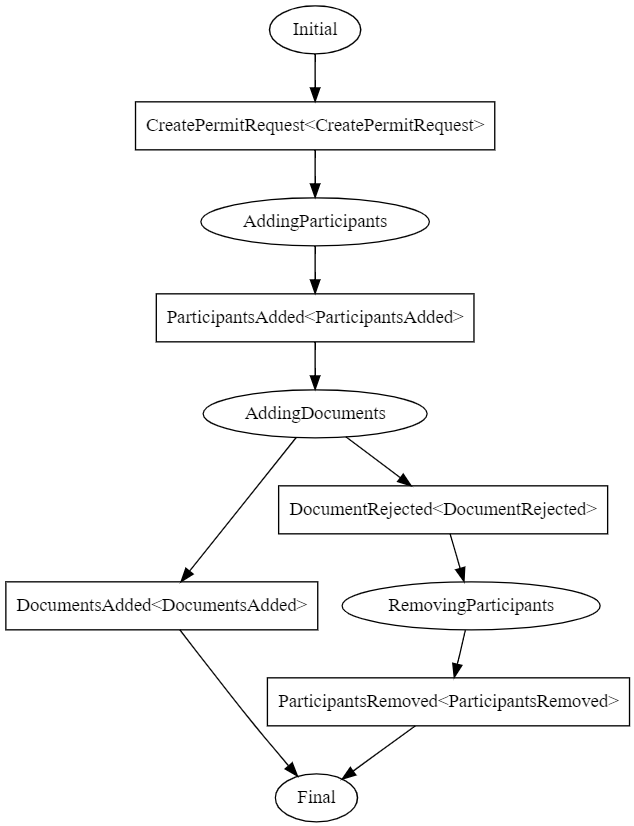

## Saga Example 

### Note: Don't use this code in production, use IPlan.Common instead.

### How to run the example:

To run the example you need to have RabbitMQ.

1. run all the projects
2. in the swagger UI execute the POST PermitRequest request and see the results
3. execute the request again with `"isValidDocument": false` and see the results (rollback on Participants)